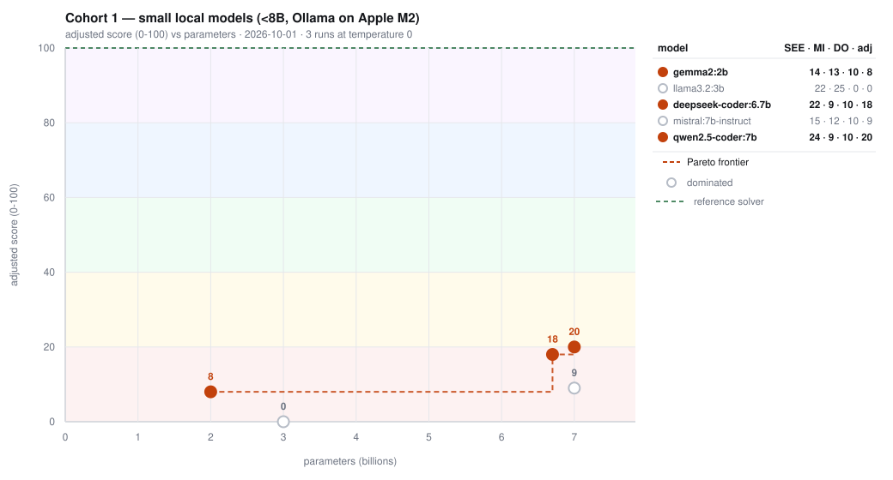

## Monkey See 🙉 Monkey Do 🙊

Two automated model evals that probe two narrow skills: **induction**, generalizing a
rule from examples instead of copying their surface; and **solver soundness**, writing
code that only makes moves it can prove are safe and stops when nothing can be proven.
No human scoring, no LLM judges, no runtime dependencies.

| Eval | Question | Score |
|---|---|---|
| **Monkey See** | Given 8 examples of an unknown function, does the model infer the rule, or copy the surface? | 50 points |
| **Monkey Do** | Given a Minesweeper position, does the model write a solver that only ever makes proven moves, and stops when nothing can be proven? | 50 points |

## Quickstart

You need Node.js 20 or newer, and nothing else: there is nothing to `npm install`.

```bash
git clone https://github.com/1999labs/monkey-see-monkey-do.git
cd monkey-see-monkey-do
```

Every command below is run from inside that directory. Check the harness works before
scoring anything:

```bash
npm run self-test        # validates the eval itself (a few seconds)
npm run dry-run          # plays the reference solver on all 450 boards; must say PASS and 50/50
```

Then score a model. Every runner runs the self-test first and refuses to score if it fails.

```bash
# A local model through Ollama: no key needed
ollama pull qwen2.5-coder:7b
npm run all -- -m ollama/qwen2.5-coder:7b

# A hosted model through OpenRouter, pay per token
export OPENROUTER_API_KEY=sk-or-...
npm run all -- -m openrouter/<model-id>

# OpenAI directly
export OPENAI_API_KEY=sk-...
npm run all -- -m openai/gpt-4o

# OpenCode Go or Zen, one key across 25 models. The prefix picks the
# wire dialect, so it must match what OpenCode documents for that model.
export OPENCODE_API_KEY=...
npm run all -- -m gogo-responses/grok-4.7        # Go, subscription plan
npm run all -- -m zen-messages/claude-fable-5.1  # Zen, pay per token
```

The first one is the cheapest way in: no key, no cost, and it proves the whole pipeline
end to end. See [OpenCode Go and Zen](#opencode-go-and-zen) before using those prefixes,
because two of the three dialects have their own traps.

`npm run all` runs both evals against one resolved model and writes three reports to
`results/`: `<model>-<date>.json` (SEE), `do-<model>-<date>.json` (DO) and
`combined-<model>-<date>.json`. `npm run see` and `npm run do` run one eval each.

Of the three, only the **combined** report is committed, because it is the evidence for
every number the cohort tables and charts print, and a chart whose source reports are absent
cannot be audited. It answers all seven score columns on its own: `see.total`,
`see.generalizationIndex`, `do.total`, `do.progressIndex`, `combined.total` and
`adjusted.total`. The per-eval reports stay local: they carry 450 `boardResults` and the raw
model response per model, nothing published cites them directly, and they are regenerated by
the next run. A cohort added to this README should commit its combined reports alongside
`docs/cohort-*.json`, or the chart is a claim without a source.

Add `-r 3` to run everything three times. The totals should agree within 2 points; if the
model returned different code each time, the output says so, and the score is a sample,
not a measurement.

## Adding a model

You probably do not need this section. These prefixes work with no configuration file at
all, so `-m <prefix>/<model-id>` is the whole procedure, exactly as in the Quickstart:

`openrouter/…` · `openai/…` · `ollama/…` · `gogo/…` · `gogo-responses/…` ·
`gogo-messages/…` · `zen/…` · `zen-responses/…` · `zen-messages/…`

The rest of this section covers the two cases where that is not enough.

### OpenCode Go and Zen

Both serve one key across the same three dialects, so the prefix picks the endpoint rather than a
lookup table of model ids, which would go stale the next time OpenCode adds a model. Go is the
subscription plan for open models; Zen is pay-per-token and is where the frontier models are.

| Prefix | Go endpoint | Zen endpoint | Dialect |
|---|---|---|---|
| `gogo/`, `zen/` | `/zen/go/v1/chat/completions` | `/zen/v1/chat/completions` | OpenAI chat |
| `gogo-responses/`, `zen-responses/` | `/zen/go/v1/responses` | `/zen/v1/responses` | OpenAI Responses |
| `gogo-messages/`, `zen-messages/` | `/zen/go/v1/messages` | `/zen/v1/messages` | Anthropic Messages |

```bash
export OPENCODE_API_KEY=...
npm run all -- -m gogo-responses/grok-4.7
npm run all -- -m zen-messages/claude-fable-5.1
```

**Pick the prefix from the dialect OpenCode documents for that model, not from its family.**
Claude Fable is a Messages model, so it is `zen-messages/claude-fable-5.1`, even though it is the
strongest model in the catalogue. The wrong prefix is a 404 rather than a misrouted request, which
is the intended failure.

Both ask clients to send their own user agent and a stable `x-opencode-session`, and Go says traffic
is monitored for abuse. The presets send both, with one session id per process so the calls of a run
share it and prompt caching still applies.

Three limits worth knowing. Go's per-model monthly caps bind well before Zen's pay-per-token
pricing does, so a `-r 3` check on an expensive model can stall partway through a month.
`--only-provider` is refused for both, since each is the only route to its models. And Zen serves
seven Gemini models on a fourth dialect, `/v1/models/gemini-*`, which has no adapter here.

### Keys

Checked in this order: `--key`, the provider's environment variable,
`~/.config/monkeydo/keys/<ENV_NAME>` (or `~/.config/monkeydo/key` for OpenRouter), then a
`NAME=value` line in `.env`. Keys are never written into the repository or into results.

### Adding a provider that is not built in

Only needed for an endpoint the suite does not already speak. Still no code changes.
Copy the example registry and edit it:

```bash
cp config/models.example.json config/models.json
```

```json
{
  "providers": {
    "groq": {
      "adapter": "openai",
      "endpoint": "https://api.groq.com/openai/v1/chat/completions",
      "apiKeyEnv": "GROQ_API_KEY",
      "supportsTemperatureZero": null
    }
  },
  "models": {
    "openai/o3-mini": {
      "adapter": "openai",
      "endpoint": "https://api.openai.com/v1/chat/completions",
      "model": "o3-mini",
      "apiKeyEnv": "OPENAI_API_KEY",
      "supportsTemperatureZero": false
    }
  }
}
```

- A **provider** entry makes every `groq/<model-id>` work. A **model** entry configures one id exactly.
- `adapter` is `openai` for any OpenAI-compatible `/chat/completions` endpoint (OpenRouter, Groq,
  Together, vLLM, LM Studio, …), `responses` for any OpenAI Responses endpoint, `anthropic` for any
  Anthropic Messages endpoint, or `ollama`.
- `apiKeyEnv` names the environment variable holding the key; `null` means no key (local servers).
- `supportsTemperatureZero`: `true`, `false`, or `null` (unknown until a `-r 3` check). With
  `false` the runner **refuses to score** unless you pass `--i-cannot-control-temperature`, and the
  result is stamped as not comparable. A model sampled above temperature 0 is a different experiment.
- `maxOutputTokens` caps the response on `responses` adapters. Leave it unset: a limit this harness
  chose can truncate a solver the model had room to finish, and a self-inflicted truncation scores
  like a weak model.
- `maxTokens` is the required `max_tokens` on `anthropic` adapters. It defaults to 32000. Raise it
  if a long solver is truncated; lower it only to cap cost.
- `anthropicVersion` is the date header that dialect requires, e.g. `2023-06-01`.
- `timeoutMs` is how long one model call may take before it is abandoned, defaulting to
  **420000** (7 minutes). That covers the slowest response measured against a real endpoint
  (361s) with headroom, because reasoning models emit tokens for minutes before answering. Set it
  per model for anything slower. A timeout is **never retried**: it has already spent the whole
  budget, and three attempts turned one stalled model into an 18-minute wait. Other transport
  failures are still retried. The budget in force is stamped as `solver.callTimeoutMs`, so a
  timeout is readable afterwards rather than looking like an unexplained zero.

Built in, with no config: `openrouter/…`, `openai/…`, `ollama/…`, `gogo/…`, `gogo-responses/…`,
`gogo-messages/…`, `zen/…`, `zen-responses/…`, `zen-messages/…`.

#### Pin the provider on OpenRouter, or the score is not a measurement

One model id is served by many hosts. `deepseek/deepseek-v4.1-flash` had **33** endpoints at the
time of writing, across `fp4`, `fp8`, `fp32` and unquantised builds. An unpinned run therefore
samples a different machine each time, and `-r 3` reports `NOT_REPRODUCIBLE` for a model that is
in fact fine. Measured: one unpinned model returned totals of 21, 50 and 50.

```bash
npm run providers -- -m openrouter/deepseek/deepseek-v4.1-flash
npm run do -- -m openrouter/deepseek/deepseek-v4.1-flash --only-provider Alibaba --no-fallback -r 3
```

Two things to expect. A slug from the listing may still be unavailable to your account, in which
case the request fails with "0 endpoints out of 1 requested are available"; `--no-fallback` then
fails the run outright instead of quietly routing elsewhere, which is the point. And a pinned
provider may simply be worse: Alibaba timed out on all three runs for a model that other providers
answered in 203s.

## Scoring

Two evals, each out of 50, each with a second reported axis beside its score. Monkey See
reports the **Generalization Index**: did performance carry to inputs the model was not
shown? Monkey Do reports the **Progress Index**: did the solver make provable moves, or
collect its points by doing nothing?

The two axes are deliberately parallel, because they catch the same kind of cheat in
opposite evals. Neither is scored. Both are reported beside their own eval's score, and an
**adjusted** total folds them in when you want a single number to plot.

They are not otherwise alike, and the difference matters: the Generalization Index is an
unbounded *gap* with no components, subtracted from the total, while the Progress Index is a
*bounded capability* out of 15 with three components, used to claw points back.

### Monkey See (induction, out of 50)

Given 8 examples of an unknown function, does the model infer the rule or copy its surface?

| Component | Points | What it takes |
|---|---|---|
| Task A | 15 | Recovers the rule from 8 examples, applied to 50 unseen inputs |
| Task B | 15 | Same, for a string rule |
| Task C | 15 | Same, for an array rule |
| Robustness | 5 | Code that does not throw on any of the 150 held-out cases |

A naive implementation of each task scores 32–36%, **by design**: that floor is the point.

#### The Generalization Index (GZ): reported, not scored

`GZ = seen pass rate − held-out pass rate`, in points. It asks a different question from the
score: *did performance carry from the examples the model was shown to inputs it had not
seen?*

| GZ | Reading |
|---|---|
| 0–10 | **generalizes**: held-out performance matches shown performance |
| 11–30 | **mostly generalizes**: held-out trails shown on some cases |
| 31–60 | **partial** |
| 61+ | **SURFACE FIT**: shown performance carried no information about held-out |

A low GZ is evidence of generalization, **not proof of abstraction**: a heuristic fitted to
one distribution would score the same. Two models can share a score and sit at opposite ends
of this scale, which is why it is reported next to the score and never merged into it.

### Monkey Do (deduction, out of 50)

The model writes `solve(board, mines)` **once**. That single function is replayed on 450
generated boards, and every move is checked for *proof*: a move must be provably safe, not
merely lucky.

| Component | Points | What it takes |
|---|---|---|
| Pool A | 30 | Wins each of 300 boards that pure deduction can solve, every move proven |
| No confident error | 10 | Never detonates, never guesses, never breaks |
| Pool B | 10 | On 150 boards reaching an unprovable position, plays all proven moves then correctly returns `null` |

Outcomes per board: `won`, `surrender` (a correct stop), `premature_surrender`,
`detonation`, `unproven_move` (safe by luck, **scored like a detonation**),
`protocol_violation`, `stalled`, `no_response`.

Random play survives 0% of boards, so a Pool A win cannot be luck. It does not show the
solver was *derived* rather than recalled; see the first two limitations.

#### When the model never answers

Any model must produce a report, including one whose endpoint stalls or errors. A call that
times out, returns a non-JSON body, or fails on the network is caught and scored as
`no_response` on every board, so the report is still written. The budget is enforced, never
removed; a hung request still fails, just at whatever `timeoutMs` that model declares rather than
a single global ceiling.

A `no_response` run scores **0/50**, and `solver.callFailure` in the report gives the reason:
`timeout`, `rate_limited`, `auth_failed`, `http_<status>`, `network_error`,
`non_json_response`, or `provider_error`. A `timeout` also carries `timeoutMs` and `attempts`, so
the report says how long it waited and that it did not try again.

**A 0 beside `callFailure` is not a measurement of the model.** It is the score of a call
that never returned, and it says something about the endpoint, the provider, or the budget,
not about reasoning. Check the field before quoting the number. Reasoning models that spend
the whole budget emitting reasoning tokens and never emit an answer land here, which is a
real and common failure rather than a harness fault.

This is deliberately kept separate from `protocol_violation`, which means the model *did*
answer and the answer was unusable. One is a wrong answer, the other is a missing one.

The reference solver scores **50/50** with a Progress Index of **15/15**. `npm run dry-run`
proves that on all 450 boards, and no model is scored unless it passes first.

#### The Progress Index: reported, not scored, out of 15

DO's 50 points measure two different things: whether a solver *cleared* a board, and whether
it *stayed out of trouble*. A solver returning `null` on its very first call clears nothing,
so it scores 0 of the 30. It also never detonates, so it banks the full 10 for "no
confident error" and lands on **10/50**.

That 10 flatters it. Ten points for a solver that did nothing reads like partial competence.
The Progress Index grades **provable progress** on the same 450 boards and the same replay:
no extra model calls, no extra boards, no change to the prompt.

| Component | Points | What it takes |
|---|---|---|
| Initiation | 5 | Share of Pool A boards where it made at least one proven move |
| Depth | 5 | Mean proven moves, scaled to the reference solver's 75 and capped there |
| Breadth | 5 | Fraction of the three Pool A tiers it reached |

Reference solver: **15/15**, at a mean of 74.99 proven moves per board. Pool B is excluded:
quitting correctly there is not progress, and DO already scores it.

### The adjusted total: the one number to plot

`SEE + DO` is out of 100 and already maxes out, so GZ and the Progress Index have nowhere
to go. The adjusted total folds both in. **It is a reporting layer only**: SEE, DO, both
indices and their components are all unchanged on every report, and the reference solver
still scores 100.

```
adjusted = clamp( SEE + DO  −  0.5 × GZ  −  10 × (1 − initiationRate),  0, 100 )
```

The two adjustments point in **opposite directions**, which is why they are not one formula:

- A high **GZ inflates** a score. Memorizing the shown examples looks like competence and
  collects held-out points it has not earned, so it is **subtracted**.
- A low **Progress Index** inflates nothing; it means a solver did nothing. Those 10 points are
  real points in the 50 and are not removed here. Instead the *unearned portion* is clawed
  back, scaled by how few boards the solver engaged on.

Worked example. `gemma2:2b` scored SEE 14 + DO 10 = 24, but all 10 DO points were free (it
made zero moves) and its GZ of 13 says some of the 14 was memorization:

```
24  −  6.5 (GZ 13 × 0.5)  −  10 (never engaged)  =  8
```

The weights are hand-chosen, and this project freezes hand-chosen weights for a reason. See
[`docs/calibration.md`](docs/calibration.md). They live in `src/adjusted.mjs` rather than
buried in a formula so a reader can disagree with them. The adjusted total is a **derived
figure**: never quote it without the components it came from.

## Results

Each cohort gets its own chart, generated from the JSON reports rather than drawn by hand, so
a figure cannot drift from the numbers behind it. Regenerate any chart with:

```bash
node bin/chart.mjs docs/cohort-1-local-small.json docs/cohort-1-local-small.svg
```

### Cohort 1: small local models

Five open-weight models under 8B, pulled from the Ollama registry and served locally on an
Apple M2 (16 GB, 100% GPU) at Ollama's default quantization. Scored 3× each at temperature 0;
all three runs returned byte-identical code, so every spread below is 0 and the score is a
measurement rather than a sample.



Sorted by Adjusted, best first. **Total** is Monkey See + Monkey Do, the raw 100; **Adjusted**
is that figure with the two indices folded in. A **●** marks a model on the Pareto frontier:
nobody else is both cheaper and better.

| Model | Params | Monkey See (N/50) | GZ Index | Monkey Do (N/50) | Progress Index (N/15) | Total | Adjusted | Pareto |
|---|---|---|---|---|---|---|---|---|
| `qwen2.5-coder:7b` | 7.0 | 24 | 9 | 10 | 0 | 34 | **20** | ● |
| `deepseek-coder:6.7b` | 6.7 | 22 | 9 | 10 | 0 | 32 | **18** | ● |
| `mistral:7b-instruct` | 7.0 | 15 | 12 | 10 | 0 | 25 | **9** | |
| `gemma2:2b` | 2.0 | 14 | 13 | 10 | 0 | 24 | **8** | ● |
| `llama3.2:3b` | 3.0 | 22 | 25 | 0 | 0 | 22 | **0** | |

**Pareto frontier:** `gemma2:2b` → `deepseek-coder:6.7b` → `qwen2.5-coder:7b`, cheapest first.
`gemma2:2b` is on it because nothing cheaper was tested and nothing below it scores higher,
not because it is the best model here; `qwen2.5-coder:7b` is. `mistral:7b-instruct` sits at the
same 7B as Qwen with less than half the Adjusted score, and `llama3.2:3b` is beaten on both
axes by the smaller Gemma.

Frontier membership is relative to the models in the cohort. A sub-2B model scoring above 8
would displace Gemma from it, so "cheapest model tested" is the claim, not "cheapest model
that exists".

#### What the numbers say

**Every model failed DO outright.** All five scored **0/15 on the Progress Index and made zero
moves on all 450 boards**: not one proven move on any board, for any model. This is the
cohort's headline and it is not a close call.

Reading their code explains why. None implemented constraint propagation. Qwen compared a
neighbour mine count against the cell it was testing, which is `null`, so the comparison was
never true. DeepSeek compared local adjacent mines against the board's *total* mine count.
Gemma tested `board[row][col] === 0` only on cells it had already established were `null`. All
three fell through to `return null` on the first call. Llama was the only genuine failure: it
shadowed the `mines` parameter inside a loop and emitted an illegal move, which is a
`protocol_violation` and therefore forfeits even the 10 unearned points. It is the only model to
score 0 on DO itself.

So DO currently measures a binary: *did the model write real constraint propagation, or
not?* Five for five, no. That is a sharp result about this tier, and it is also the reason
DO has no gradient at the bottom, which is what the Progress Index was added to expose.

**Without the Progress Index, four of these five looked like they scored 10 on DO**, a fifth of
that eval's scale, and it reads as partial competence. It was not: it was the "never
detonated" points, collected by solvers that never clicked anything. The adjusted total
removes that padding, and llama3.2:3b goes from 22 to **0**, which is the honest reading of a
model that aced the shown examples, collapsed on held-out ones (GZ 25, the worst in the
cohort), and could not produce a working solver at all.

**Coding specialization beats general purpose at equal size.** Qwen and Mistral are both 7B.
Qwen scores **20 adjusted, Mistral 9**: the same cost, more than double the score. DeepSeek
Coder 6.7B reaches 18, beating the 7B generalist. The two models purpose-built for code sit
at the top of the cohort, and the ranking is not a size effect in disguise.

**Size mostly matters, once you control for that.** Going 2B → 3B → 6.7B → 7B gives 8 → 0 → 18
→ 20. It is close to monotonic except that gemma2:2b outscores llama3.2:3b. A larger model
scoring *worse*, on both axes at once.

**Gemma 2 is the value pick by a wide margin.** 8 points at 2B against Qwen's 20 at 7B is 40%
of the score for 29% of the parameters, and it is the cheapest point on the frontier. Llama
3.2 is dominated outright: a full billion parameters more than Gemma for eight points fewer.
Nobody should pick it from this chart.

**The whole cohort is nowhere near the ceiling.** The reference solver scores 100 adjusted and
15/15 Progress Index; the best model here scores 20 and 0/15. That gap is the finding, not a
disappointment, but it means this chart says nothing yet about whether the eval *discriminates
between capable models*, because no model in it reached the range where DO starts scoring.
See "What this cohort cannot tell you" below.

#### What this cohort cannot tell you

- **DO is uncalibrated at the top.** Every model scored 0 or 10 on DO, so the entire 0–30 band
  of Pool A is untested. Until a strong model is run, there is no evidence DO separates
  competent solvers from each other.
- **The adjusted total has no resolution down here.** It compresses a 34-to-22 spread in
  `Total` into 20-to-0, and floors llama at 0. Two models with different failure modes can
  both land near the bottom, so read the components, not just the total.
- **Quantization is uncontrolled.** These ran at Ollama's default (Q4 for most), which is not
  the precision a hosted provider serves. Cohort 1 is not cleanly comparable to any hosted
  cohort until that is stated.
- **Cohort 1 is not a cost measurement.** Parameter count is an exact, portable proxy for
  compute, and it is what this axis uses. It is not a price: none of these models is
  purchasable on a hosted provider today.

## Limitations

Every report carries these, and a score quoted without them is misleading:

- **Not a coding benchmark.** Neither eval edits a repository, runs a test suite, or uses tools;
  they measure rule inference (SEE) and solver soundness (DO), the induction and deduction named
  in the lead, not software engineering.
- **DO scores a program, not a chain of thought.** The model writes `solve(board, mines)` in a
  single call and never sees an individual board, so a DO score describes the code it emitted,
  not deduction performed at inference time. A correct solver may be recalled rather than derived.
- **A low Generalization Index is evidence of generalization, not proof of abstraction.** It shows
  performance carried from shown to held-out inputs within one distribution; a heuristic fitted to
  that distribution would score the same.
- **Neither eval controls for prior exposure.** There is no canary and no novel-format control, so
  a high score cannot be attributed to reasoning over recall of the specific task or the textbook
  algorithm.
- **SEE saturates.** Frontier models reach high SEE scores and it stops discriminating at the top of
  the market; it is most informative for open-weight and mid-tier models.
- **A zero can mean the endpoint, not the model.** Any run whose report carries a non-null
  `solver.callFailure` (DO) or a `callFailure` on any task (SEE) scored zero because the call
  failed, not because the reasoning was wrong. Never present those totals as model results.
- **A score describes one provider, not a model.** It is what that gateway served on that day.
  OpenRouter load-balances across providers, so pin one with `--only-provider --no-fallback` or the
  number mixes machines. OpenCode Go is a curated pairing, but not a fixed one. Neither is a
  statement about the underlying weights, and two scores taken months apart may not be comparable.
- **Not comparable to SWE-bench, HumanEval, or any external leaderboard.** Different scale, different
  construction; never present these numbers alongside one.
- **DO has residual contamination risk.** Constraint propagation with search is a textbook
  algorithm, so a high DO score shows the model can produce a correct solver, not that it deduced
  one afresh.
- **Two narrow tasks.** Not a general intelligence measure, and the 50-point weights are hand-chosen
  (frozen at suite version 0.2.0).
- **The adjusted total is derived and hand-weighted.** It subtracts `0.5 × GZ` and claws back the
  no-confident-error points a solver did not earn, both with judgement-call weights. It moves no
  50-point score and the reference solver still reads 100, but it is a convenience for plotting,
  not an independent measurement. Quote the components.
- **The Progress Index only discriminates on engagement.** Its initiation and breadth components
  measure whether a solver moved at all. A cohort of solvers that never engages scores 0/15
  uniformly, and the Progress Index then separates nothing. It explains the DO score rather than
  refining it.

## Maintaining the suite

| Command | What it does |
|---|---|
| `npm test` | Unit and end-to-end tests (no network; the CLI tests use a stubbed fetch) |
| `npm run self-test` | The 141-check gate every runner enforces before it will score anything |
| `npm run self-test:full` | Self-test plus a byte-for-byte regeneration of the board pool (minutes) |
| `npm run gen-pool` | Regenerates `src/do/minesweeper/pool.json` from seed `0x5EED` |
| `npm run check-pool` | Regenerates in memory and compares with the file byte for byte |
| `npm run prompts` | Prints every prompt with its SHA-256 and whether it matches the recorded digest |
| `npm run acceptance -- --strong <model> --weak <model>` | The publication gate; add `--quick` to rehearse |
| `npm run diagnose -- -m <model>` | Runs each SEE task several times and saves raw responses, to tell endpoint noise from harness bugs |
| `node bin/chart.mjs <cohort>.json [<out>.svg]` | Regenerates a cohort chart from its JSON report data |

Every push and pull request runs `npm test` and `npm run self-test` on Node 20 via
[`.github/workflows/ci.yml`](.github/workflows/ci.yml). Pool regeneration is deliberately
off that path because it takes minutes, so `check-pool` and `self-test:full` run nightly and on
demand from the Actions tab instead. There are no dependencies to install, so CI only
checks out and runs Node.

Changing a prompt changes its digest: update `src/prompt-digests.mjs` and bump the suite version, deliberately.
Changing the oracle or pool classification: bump `GENERATOR_VERSION` in `pool.mjs` and run
`npm run gen-pool`; loading a pool built by a different generator fails loudly.

Every number the suite asserts (the naive baselines, the 0% random baseline, the
effort cap and how it was derived, the pool's shape and acceptance rates, the
Progress Index's depth reference of 75 and the adjusted total's weights) is
recorded in [`docs/calibration.md`](docs/calibration.md), with the commands that
re-derive each one. Read it before changing a held-out set, the pool, the oracle
or the cap.

### The publication gate

`npm run acceptance` runs every criterion below and writes
`results/acceptance-<date>.json`. `--quick` rehearses on a subset and can never
report a pass.

| Criterion | Requirement |
|---|---|
| Discriminates strong from weak | A known-strong model outscores a 7B model on both evals |
| Naive baseline lands in band | 20–45% on every SEE task |
| Random baseline lands in band | DO random survival is 0% on every tier |
| Oracle reaches 100% | The reference solver wins every Pool A board and stops correctly on every Pool B board, so a dry run scores 50/50 |
| Variance is low | Three runs at `temperature: 0` differ by ≤ 2 points |
| Self-test passes | Every self-test check, including full pool regeneration |

If any criterion fails, the eval is not published. An eval that does not
discriminate is worse than no eval, because it manufactures false confidence.

## Repository layout

Reference only. Nothing in here is needed to run the evals.

```
monkey-see-monkey-do/
├── config/models.example.json   model registry template
├── docs/calibration.md          every asserted number, and how it was measured
├── results/combined-*.json      committed: the evidence for every published score
├── docs/cohort-*.json           chart source data, derived from results/
├── docs/cohort-*.svg            generated charts: edit the JSON, not these
├── src/
│   ├── adapters/                openai.mjs, responses.mjs, anthropic.mjs, ollama.mjs, registry.mjs
│   ├── sandbox.mjs              node:vm execution, per-call timeout, code extraction
│   ├── cli.mjs                  shared runner plumbing, temperature rule, self-test gate
│   ├── key.mjs                  API key resolution, shared by both evals
│   ├── fingerprint.mjs          response hashing and reproducibility, shared by both evals
│   ├── self-test.mjs            the checks that must pass before any score is recorded,
│   │                            and the `npm run self-test` entry point
│   ├── prompt-digests.mjs       recorded SHA-256 of every prompt
│   ├── report.mjs               JSON reports and the limitations they carry
│   ├── adjusted.mjs             the adjusted total: folds GZ and the Progress Index into
│   │                            one figure, reported beside SEE + DO and never inside them
│   ├── run-all.mjs              both evals, one model, combined report
│   ├── see/                     SEE only: reference.mjs (ground truth), tasks/*.json,
│   │                            tasks.mjs, prompt, score, run
│   └── do/                      DO only: prompt, score, run, reference-solver.mjs,
│       │                        progress-index.mjs (the 15-point progress axis)
│       └── minesweeper/         board.mjs, oracle.mjs, pool.mjs, pool.json
├── bin/                         command-line entry points, one per npm script:
│                                gen-pool, acceptance, diagnose, providers, show-prompts,
│                                chart (cohort JSON -> SVG)
├── compare.sh                   run several pinned models 3× each, side by side
└── tests/                       node:test suites
```

`src/see/` and `src/do/` hold only what is private to their own eval. Anything both
evals need (key resolution, response fingerprinting, the sandbox, reporting, the adjusted
total) lives at the top of `src/`, so neither eval's folder reaches into the other's.
