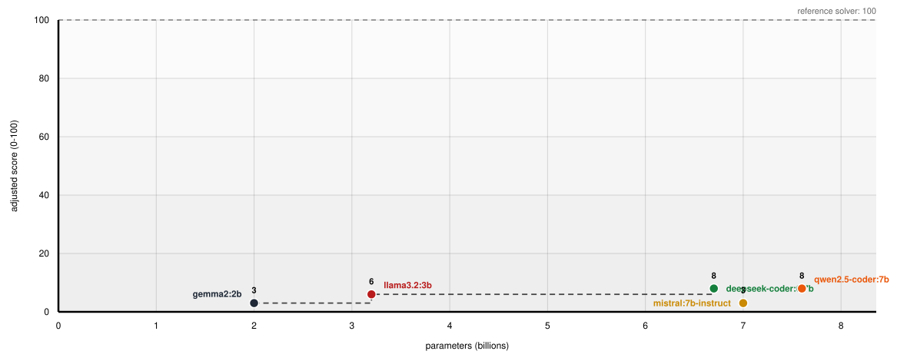

## Monkey See 🙉 Monkey Do 🙊

Two automated model evals that probe two narrow skills: **induction**, inferring
a rule from a handful of examples instead of copying their surface; and
**sustained deduction**, writing a chain of moves in a novel formal system where
every step is provably legal and the chain ends on the target.
No human scoring, no LLM judges, no runtime dependencies.

They are useful for model selection because they catch complementary failures: a
model that copies examples instead of inferring rules (See's surface-fit axis), or
one whose code is correct for five steps but breaks at thirty (Do's chain-length
gradient). The score is mechanical, the workload is fixed and bounded, and every
run is cheaply repeatable.

| Eval | Question | Score |
|---|---|---|
| **Monkey See** | Given a handful of examples of an unknown function, does the model infer the rule, or copy the surface? | 50 points |
| **Monkey Do** | Given a string-rewrite chain of up to 50 steps in a 5-rule formal system, does the model write a derivation where every step is provably legal and the chain reaches the target? | 50 points |

## Quickstart

Node.js 20+ required. Nothing to `npm install`.

```bash
git clone https://github.com/1999labs/monkey-see-monkey-do.git
cd monkey-see-monkey-do
```

Check the harness works before scoring anything. Every runner executes the self-test
first and refuses to score if it fails:

```bash
npm run self-test        # validates the eval itself (a few seconds)
npm run dry-run          # plays the reference solver on all 50 chains; must say 50/50
```

The cheapest way to score a model is local through Ollama. No API key required, no cost:

```bash
ollama pull qwen2.5-coder:7b
npm run all -- -m ollama/qwen2.5-coder:7b
```

Hosted models need one environment variable:

```bash
export OPENROUTER_API_KEY=sk-or-...
npm run all -- -m openrouter/<model-id>

export OPENAI_API_KEY=sk-...
npm run all -- -m openai/gpt-4o
```

OpenCode Go and Zen also work (one key, 25 models, `gogo-…`/`zen-…` prefixes), but
their wire dialects have traps worth reading first: see
[`docs/scoring-models.md`](docs/scoring-models.md). The same file covers custom
provider registries, key resolution order, and the OpenRouter provider-pinning rule
that makes a hosted score a measurement rather than a dice roll.

Add `-r 3` to run everything three times. The totals should agree within 2 points;
if the model returned different code each time, the output says so, and the score is
a sample, not a measurement.

`npm run all` writes three reports to `results/` - SEE, DO and a **combined** report.
Only the combined report is committed: it is the evidence for every published number.
See [`docs/scoring-models.md`](docs/scoring-models.md) for the report formats.

## Scoring

Each eval is out of 50. Each also reports a second, unscored axis that catches the
same cheat from the opposite direction: Monkey See reports the **Generalization
Index** (did performance carry from shown examples to held-out inputs?), Monkey Do
the **chain-engagement rate** (did the solver make at least one legal step per
chain?). An **adjusted** total (out of 100) folds both into one number to plot,
never overwriting the raw scores:

```
adjusted = clamp( SEE + DO  −  0.5 × GZ_mean × ((SEE + DO) / 100)
                   −  10 × (1 − chainEngagementRate),  0, 100 )
```

- The GZ term subtracts points earned by surface-fitting; the earned-fraction
  scaling means a model can only lose surface-fit points out of the points it
  actually earned.
- The engagement term claws back the points a do-nothing submission would
  otherwise collect for free; it is deliberately unscaled.

The full machinery - SEE's sample-efficiency weights, DO's chain pool and scoring
contract, the random-walk baseline, the reference solver's two modes, worked
examples for the adjusted formula - is in
[`docs/scoring-detail.md`](docs/scoring-detail.md), and every asserted number is
recorded with its re-derivation command in
[`docs/calibration.md`](docs/calibration.md).

## Results

### Cohort 1 

Seven frontier reasoning models

### Cohort 2

Five small local Ollama models, each scored `-r 3` at temperature 0 (spreads 0,
REPRODUCIBLE on both evals; methodology in
[`docs/ollama-local-models.json`](docs/ollama-local-models.json)). The **adjusted**
column is the one used in the Pareto chart; the **penalties** column shows both formula
components so a reader sees why each figure is what it is.

| model | paramsB | SEE | DO | gzMean | engagement | **adjusted** | penalties |
|---|---|---|---|---|---|---|---|
| `deepseek-coder:6.7b` | 6.7 | 20 | 0 | 16.9 | 0    | **8** | −1.69 GZ, −10 claw |
| `qwen2.5-coder:7b`    | 7.6 | 19 | 1 | 21.65 | 0.04 | **8** | −2.16 GZ, −9.6 claw |
| `mistral:7b-instruct` | 7.0 | 13 | 0 |  7.06 | 0    | **3** | −0.46 GZ, −10 claw |
| `llama3.2:3b`         | 3.2 | 18 | 0 | 24.9 | 0    | **6** | −2.24 GZ, −10 claw |
| `gemma2:2b`           | 2.0 | 14 | 0 | 20.12 | 0    | **3** | −1.41 GZ, −10 claw |



*Adjusted score against parameter count (billions) for five local Ollama models
under 8B, scored -r 3 at temperature 0 under suite 1.1.0. The reference solver sits
at 100, far above every model.*

Every model's DO score is near zero, and that is the finding, not a defect: none of
them writes a working chain solver, and the per-model **failure modes differ**
(inverted rules, type confusion, unbounded loops). The DO gradient - where frontier
models start to separate - is what the frontier cohorts will test next.

Re-derive from a fresh clone (no model calls; reads the committed reports):

```bash
python3 scripts/build-cohort.py
node bin/chart.mjs docs/ollama-local-models.json docs/ollama-local-models.svg
```

Before committing any new cohort evidence, run the publication gate:
`npm run acceptance -- --strong <model> --weak <model>` (criteria in
[`docs/maintaining.md`](docs/maintaining.md)).

## Limitations

Every report carries these (in its `limitations` field), and a score quoted
without them is misleading.

- **Not a coding benchmark.** Neither eval edits a repository, runs tests, or uses
  tools; they measure rule inference and sustained derivation, not software
  engineering.
- **DO scores a program, not a chain of thought.** The model writes one `solve()`
  and never sees a chain; a DO score describes the code it emitted, which may be
  recalled rather than derived.
- **A low GZ is evidence of generalization, not proof of abstraction.** A heuristic
  fitted to the shown distribution would score the same.
- **No prior-exposure control.** The DO prompt carries a canary that flags
  retraining, not recall of the solving algorithm; SEE has no canary. A high score
  cannot be attributed to reasoning over recall.
- **SEE saturates at the frontier.** It discriminates best for open-weight and
  mid-tier models.
- **A zero can mean the endpoint, not the model.** Check `callFailure` in the report
  before quoting any zero.
- **A score describes one provider, not a model.** Pin OpenRouter providers
  (`--only-provider --no-fallback`) or the number mixes machines.
- **Not comparable to SWE-bench, HumanEval, or any external leaderboard.**
- **DO has residual contamination risk.** BFS-style solvers are textbook; the
  clawback catches do-nothing submissions but not legal-step random walks (the
  random-walk baseline scores 50/50).
- **Two narrow tasks.** Not a general intelligence measure, and the adjusted total
  is a derived, hand-weighted reporting layer - quote it with its components.

## Maintaining the suite

The full command table, the publication gate and its criteria, and the committed-report
rules live in [`docs/maintaining.md`](docs/maintaining.md). The commands you'll use
day to day:

| Command | What it does |
|---|---|
| `npm test` | Unit and end-to-end tests, no network |
| `npm run self-test` | The 114-check gate every runner enforces before scoring |
| `npm run dry-run` | Reference solver plays all 50 chains; must say 50/50 |
| `npm run check-pool` | Regenerates `src/do/chain/pool.json` in memory; must be byte-identical |
| `npm run prompts` | Prints every prompt digest; all must match the record |
| `npm run acceptance -- --strong <model> --weak <model>` | The publication gate |

CI runs `npm test` and `npm run self-test` on Node 20 for every push and PR
([`.github/workflows/ci.yml`](.github/workflows/ci.yml)). Prompt changes bump the
suite version deliberately; pool changes bump `GENERATOR_VERSION` and regenerate via
`npm run gen-pool`. Every asserted number lives in
[`docs/calibration.md`](docs/calibration.md) - read it before changing a held-out
set, the pool, the BFS caps, or the adjusted weights.

## Repository layout

Reference only. Nothing in here is needed to run the evals.

```
monkey-see-monkey-do/
├── config/models.example.json   model registry template
├── AGENTS.md                    working conventions for agent sessions
├── docs/calibration.md          every asserted number, and how it was measured
├── docs/scoring-detail.md       the full scoring machinery
├── docs/scoring-models.md       providers, keys, custom registries, OpenRouter pinning
├── docs/maintaining.md          command table, publication gate, committed-report rules
├── results/combined-*.json      committed: the evidence for every published score
├── docs/ollama-local-models.*   committed cohort JSON + chart, derived from results/
├── src/
│   ├── adapters/                openai.mjs, responses.mjs, anthropic.mjs, ollama.mjs, registry.mjs
│   ├── sandbox.mjs              node:vm execution, per-call timeout, code extraction
│   ├── cli.mjs                  shared runner plumbing, temperature rule, self-test gate
│   ├── key.mjs                  API key resolution, shared by both evals
│   ├── fingerprint.mjs          response hashing and reproducibility, shared by both evals
│   ├── self-test.mjs            the checks that must pass before any score is recorded,
│   │                            and the `npm run self-test` entry point
│   ├── prompt-digests.mjs       recorded SHA-256 of every prompt
│   ├── report.mjs               JSON reports and the limitations they carry
│   ├── adjusted.mjs             the adjusted total: folds GZ_mean and chain-engagement rate into
│   │                            one figure, reported beside SEE + DO and never inside them
│   ├── run-all.mjs              both evals, one model, combined report
│   ├── see/                     SEE only: reference.mjs (ground truth), tasks/*.json,
│   │                            tasks.mjs, prompt, score, run-levels, run
│   └── do/                      DO only — the chain eval files live entirely under chain/:
│       └── chain/
│           ├── rules.mjs        5 rewrite rules over 7 symbols {A,B,C,D,X,Y,Z}
│           ├── reference.mjs    the BFS reference solver (dry-run 50/50,
│           │                     real-mode 45/50 with MAX_STATES=50000)
│           ├── generator.mjs    chain pool generator (seed 0xC0FFEE, 5 bands)
│           ├── pool.mjs         chain pool loader / GENERATOR_VERSION stamp / sha256
│           ├── pool.json        50 chains, sha256 f87d0b1906fc7906…, seed 0xC0FFEE
│           ├── prompt.mjs       chain DO prompt + digest pin + canary
│           ├── run.mjs          the chain DO model-path runner
│           ├── score.mjs        per-chain full/partial/empty + chainEngagementRate
│           └── dry-run.mjs      the chain DO dry-run entry point
├── bin/                         command-line entry points, one per npm script:
│                                gen-chain-pool, acceptance, diagnose, providers,
│                                show-prompts, chart (cohort JSON → SVG)
└── tests/                       node:test suites
```

`src/see/` and `src/do/` hold only what is private to their own eval. Anything both
evals need (key resolution, response fingerprinting, the sandbox, reporting, the adjusted
total) lives at the top of `src/`, so neither eval's folder reaches into the other's.
